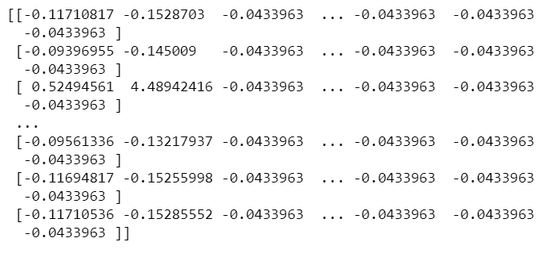
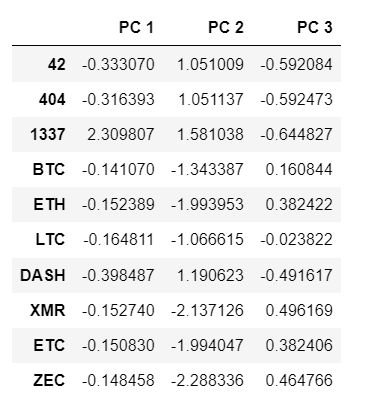
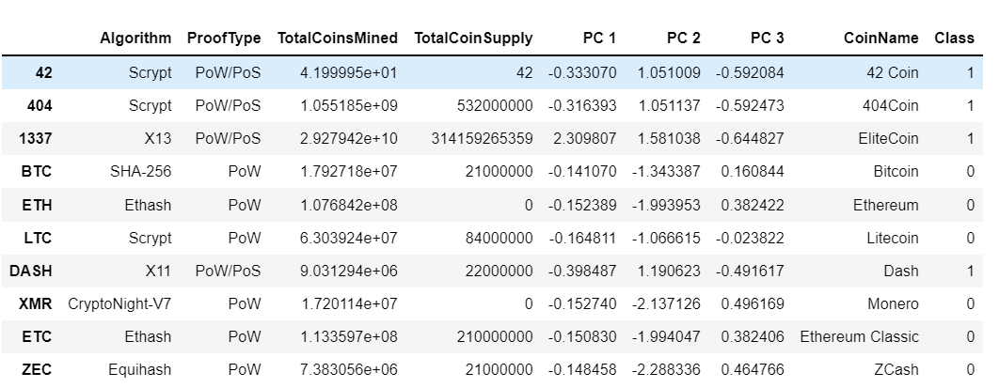
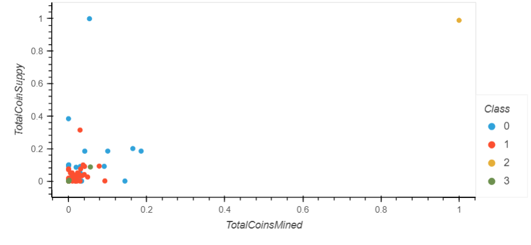

# Cryptocurrencies

## Overview of Project 
### Purpose
The purpose of this project has created a report that includes which cryptocurrencies are on the trading market, and classified and analyze it to create a portfolio for an Accountability Accounting bank, with the goal of offering an investment option for their customers. In this project we use unsupervised machine learning, preprocessing the Data for PCA, Reducing Data Dimensions Using PCA, Clustering Cryptocurrencies Using K-means, and Visualizing Cryptocurrencies Results. 

## Results 

### Preprocessing the Data for PCA

For this part, after dropping and cleaning the data that we are going to use, we got variables for text features, by columns Algorithm and ProofType, after that we standardize the data frame, we used StandardScaler() function, we observe the output above, and the image shows the data already transformed.

### Reducing Data Dimensions Using PCA

Before clustering, we create a new data frame with the three principal components created, to reduce the data. We observe, the data frame with scaler data, the same index, and three different columns for each component.

### Clustering Crytptocurrencies Using K-means 

We did the elbow curve, which showed us that k =4, we ran the K-means model, and finally, we created a new data frame ths showed the original data with the three principal components and the columns class, that shows the predicted data, In the end, we have 532 raws and 9 columns in the final data frame.

### Visualizing Cryptocurrencies Results. 

The final step was to visualize the final data, relation the Total Coins Mined and Total Coin Supply showed by class and each point shows us the Class, Total Coins Mined, Total Coin Supply and Coin Name. We used hvplot.scatter function for this figure. We can observe the data is concentrated in less than .2 total coin Supply and 0.1 Total coins mined, we observe some outliers for class 0 and class 2. 

## Summary
Apparently, on the final visualization, we can observe more orange points, that correspond to class 1, also in the 3D plotting classes 0 and 1 are more points, so these two are the more trending predicted on the market.
